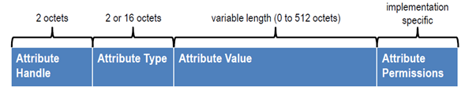

# BLE with the XIAO MG24

Primary Source: [xiao mg24 bluetooth](https://wiki.seeedstudio.com/xiao_mg24_bluetooth/)

## Fundamental Concepts

Within BLE there are two types of devices, **Server** and **Clients**
> The MG24 can act as either a **Client** or **Server**.

### Server

- Advertises its existence
- Can be found by other devices
- Contains the data that the Client data can read

### Client

- Scans the nearby devices
- Connects to the server that it looks for
- listens to incoming data from the connected server

> *This is knows as point-to-point communication*

### Attribute

***"Its a piece of data"***

Each bluetooth device is provides a service and that service is a collection of data.

The collection can be called a **Database**, where each entry into the database is an **Attribute**

> ***Attribute** => "data entries"*

We can think of Bluetooth devices as a table where each row inside is an Attribute

### GATT

GATT (Generic Attribute Profile) is a communication protocol that defines how data is transmitted between bluetooth devices that have established a connection.

The GATT protocol organised a devices functions and properties are organised into structures called **Services**, **Characteristics**, and **Descriptors**.

- Services: 
  - A set of related functions aand features that are provided by a device.
  - Can include multiple characteristics that define certain properties and features provided by a device
    > Examples being *Sensor Data* or *Control Commands*
- Characteristics:
  - Each one has **Unique ID** and **Value**
  - The Characteristic can be both read and written too
- Descriptors:
   - Describes the metadata of characteristics
        > Eg. Format, Access Permissions of Characteristic values

### BLE Characteristics
